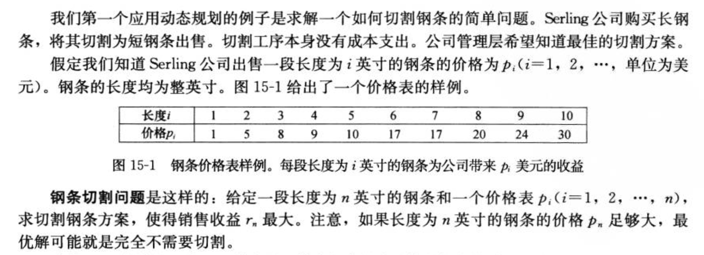
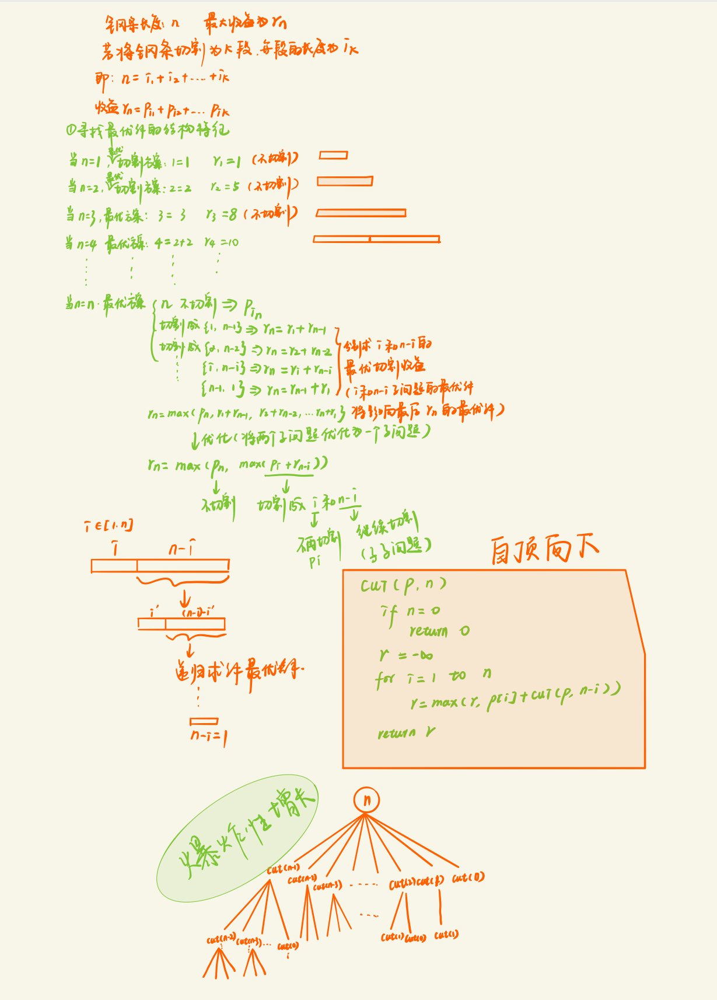
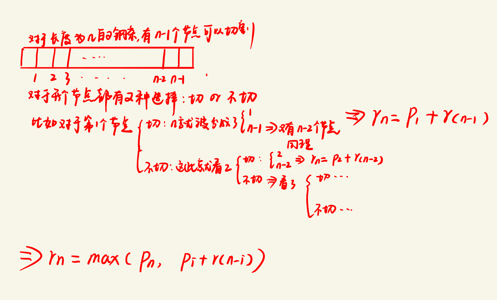
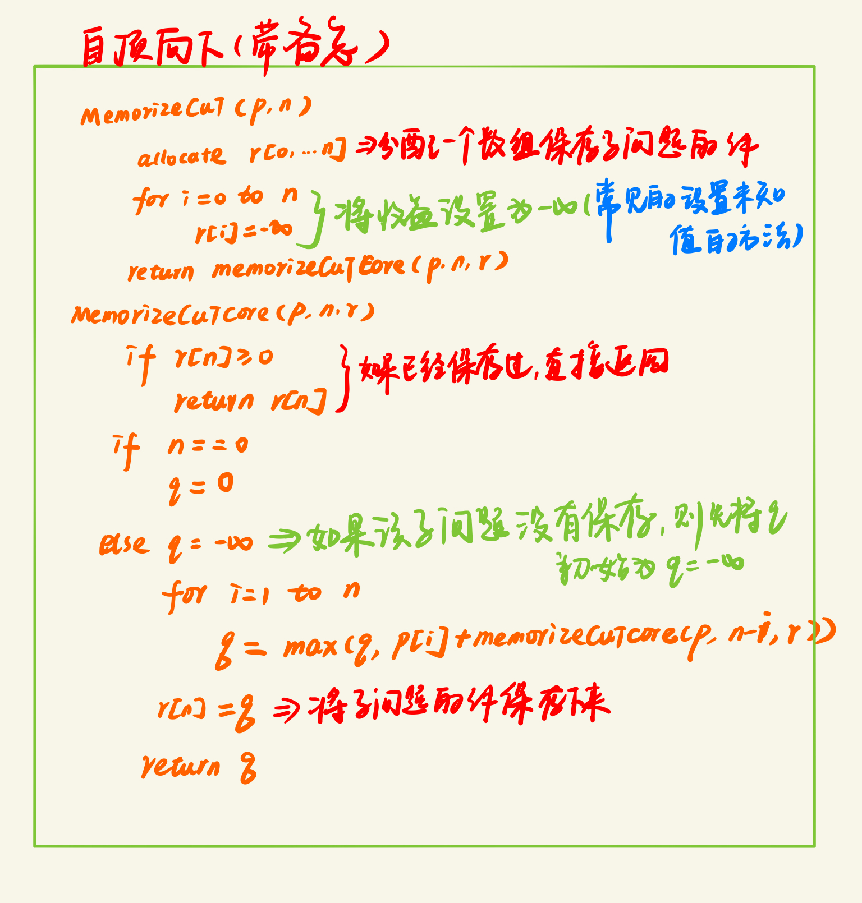
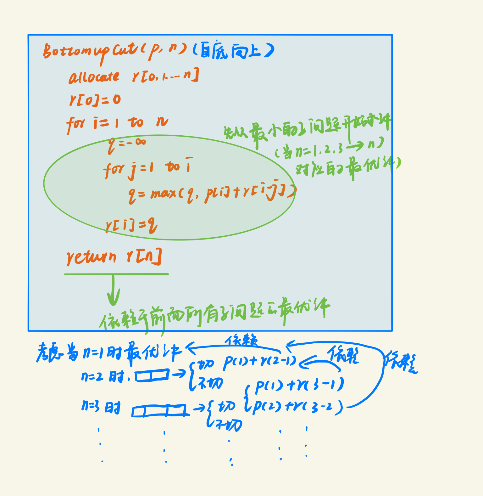
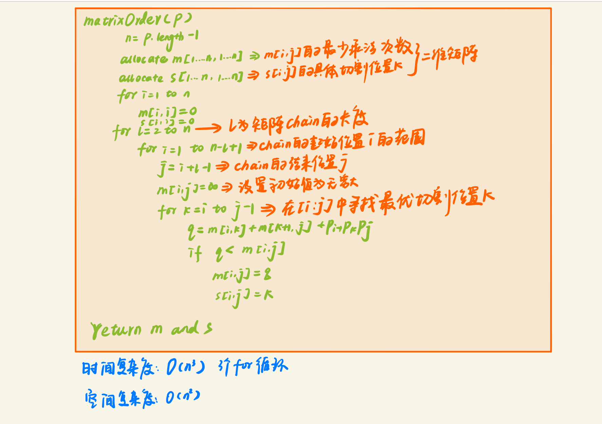
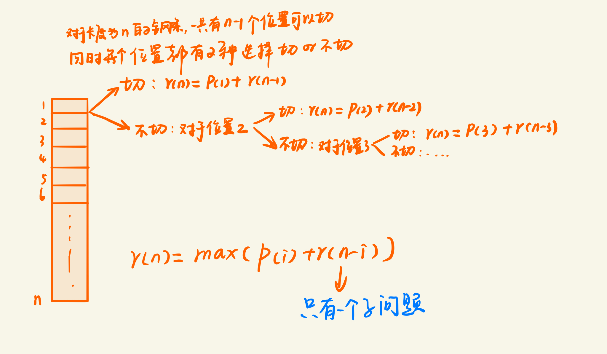
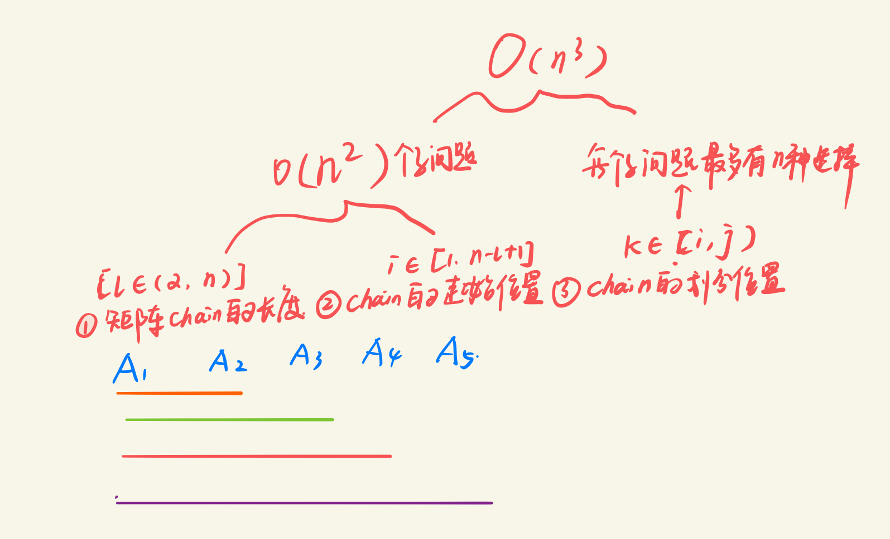

[TOC]

## 重温动态规划~

今天刷leetcode:[<u>198. House Robber</u>](https://leetcode.com/problems/house-robber/)时用到了动态规划，看的是一个小哥哥的视频讲得灰常的清晰明了，推荐:clap:！！！[<u>basketwangCoding</u>](https://www.youtube.com/watch?v=-i2BFAU25Zk)，看他的视频突然想到了算法分析课DQ老师当时给我们讲动态规划的场景，当时感觉这种思路so amazing:open_mouth:

由于刷题的时候发现很多地方都用到了动态规划，但是自己总是想不到，可能还缺一点火候吧，所以打算再看看书，梳理梳理它的思想原理

接下来是《算法导论第三版》的读书笔记

### 什么是动态规划

维基百科的解释：

动态规划（英语：Dynamic programming，简称DP）通过把原问题分解为相对简单的子问题的方式求解复杂问题的方法。

动态规划常常适用于有**<u>*重叠*</u>**子问题和**<u>最优</u>**子结构（英语：Optimal substructure）性质的问题，动态规划方法所耗时间往往远少于朴素解法。

> 最优子结构：一个问题的最优解包含其子问题的最优解
>
> 所以如果我们需要寻找原问题的最优解，那么我们就需要考察最优解中用到的所有子问题的最优解

动态规划背后的基本思想非常简单。大致上，若要解一个给定问题，我们需要解其不同部分（即子问题），再根据子问题的解以得出原问题的解。

通常许多子问题非常相似，为此动态规划法试图仅仅解决每个子问题**<u>一次</u>**，从而减少计算量：一旦某个给定子问题的解已经算出，则将其**记忆化存储**，以便下次需要同一个子问题解之时直接查表。这种做法在重复子问题的数目关于输入的规模呈指数增长时特别有用。

所以总结一下就是：

- **动态规划适用于子问题有重叠依赖的情况，并且尝试寻找最优解**
- **动态规划的子问题一般只会计算一次，然后会将每个子问题的解存储下来，以便 下次使用**
- **动态规划一般用于求解最优化问题（最大or最长or最短等等），那么这个时候你就可以考虑用动态规划了，这类问题一般都会有很多的可行解，每一个可行解都有潜力成为那个最优的解，而我们的任务就是找到那个真正的最优的解**

*这里在提一下分治算法，分治算法和动态规划很像，都是通过组合子问题的解来求原问题，但是分治法的子问题之间是没有重叠的，也就是分治法的子问题之间**互不相交**，通过递归的求解子问题，再将他们的解组合起来，如果你觉得比较抽象的话，可以想想归并算法，归并算法算是一个比较典型的分治算法了，归并排序可以移步：[快速排序-归并排序-插入排序](https://blog.csdn.net/xiaoqiu_cr/article/details/95926130#_154)，分治法由于子问题都不相交，所以它会重复的求解一些公共的子子问题，相对于动态规划来说增加了计算开销*

### 如何设计一个动态规划算法

我们可以参考如下4个步骤

- 最优解有什么样的特点（题目的限定条件？）

- 选定某一个状态进行递归定义最优解

- 计算最优解（通常采用自底向上）

  

### 动态规划实例问题一：钢条切割问题

下面按照算法导论里面的讲解画了一个自己的思路，抽象派。。。:no_mouth:（看不懂的话可以直接参考算法导论里面的讲解15.1）

上面的这种算法采用自顶向下的思路，依次递归求解每个子问题，但是这种方式会重复计算大量的子问题，当n足够大时，会出现指数时间的增长

#### 带备忘的自顶向下法

所以下面基于上面的方式进行了一个优化：**以空间换时间**

通过一个辅助空间来存储子问题的解，从而避免重复计算，我们也叫作**“带备忘的自顶向下法（top-down with memoization）”**

带备忘的自顶向下法会在计算子问题的过程中将计算结果保存下来，下次计算子问题的时候先检查是否已经保存过此解，如果保存过就直接返回保存的值，否则再计算

有自顶向下就肯定有自底向上

自底向上：自底向上一般需要提前规划好子问题的规模，使得任何子问题都只依赖于“更小的”子问题的解，所以我们需要将子问题按照规模排序**，从小到大**依次求解。当求解一个子问题时，它所依赖的更小的子问题已经求解出来了，每个子问题只用求解一次（**并且也只会遇到一次**）（**就像是一个不断向上攀登金字塔的过程，每走一步都是一个脚印，并且绝不会回头:sunglasses:**）

> 通常来说自底向上方法比自顶向下方法具有更小的时间复杂性系数

#### 带备忘的自顶向下法实现钢条切割问题

这里的备忘的自顶向下的方法有几个思想我们可以借鉴：

:balloon:采用一个**辅助数组**用来存储每个子问题的解，并且数组的初始值设置为**负无穷**（**这也是一种设置未知值得常用手段**）

:balloon:递归求解时先判断辅助数组里面是否有值，如果有就直接返回

:balloon:如果没有那么就按照正常递归求解，然后最后将结果保存到辅助数组里面

算法导论上还举了一个动态规划的例子：矩阵连乘，貌似有丢丢复杂，就没仔细看了，直接找了DQ老师的PPT温习了一遍:see_no_evil:

### 动态规划实例问题二：矩阵连乘问题

首先了解什么是矩阵连乘问题：通过使用合适的加括号的方式，使得最后矩阵连乘积的乘法次数最少

完整题目：

> 给定n个矩阵｛A1,A2,…,An｝，其中Ai与Ai+1是可乘的，i=1,2 ,…,n-1。如何确定计算矩阵连乘积的计算次序，使得依此次序计算矩阵连乘积需要的数乘次数最少。

由于矩阵乘法满足结合律，所以计算矩阵的连乘可以有许多不同的计算次序。这种计算次序可以用加括号的方式来确定。

若一个矩阵连乘积的计算次序完全确定，也就是说该连乘积已完全加括号，则可以依此次序反复调用2个矩阵相乘的标准算法计算出矩阵连乘积

- 对于 *p* × *q* 矩阵 *A* 和 *q* × *r* 矩阵 *B*，*A* × *B* 需要多少次乘法计算？***p*** × ***q*** × ***r*** **次乘法计算**

- 例如: *A* 和 *B* 分别是 20 × 100, 100 × 10 矩阵, 则乘法总数为 20 × 100 × 10 = 20000

再来个例子~

通过上面的例子可以看出加括号的顺序对运算次数的影响之大，所以我们的任务就是为了找到一个最优的加括号的顺序，来使得最后的乘法次数最少

接下来开始入手，我们先将问题一般化

下面我们按照算法导论中的“**动态规划四部曲**”来一步一步的分析

- **分析最优解的结构特征**

  特征：如果A[i:j]是最优次序，那么它所包含的计算矩阵子链A[i:k]和A[k+1:j]的次序也是最优的

（**满足最优子结构性质：最优解包含着其子问题的最优解**）

- **建立递归关系**

- **计算最优解的值**（**通常采用自底向上**）

动态规划实现：

### 什么时候该用动态规划来做

看了上面两个例子我们大概对动态规划的问题有了一些了解，那到底什么时候应该派出动态规划这样的杀手锏呢:confused:

> **首先观察这个问题是否具有最优子结构的性质**：**最优解包含着其子问题的最优解**
>
> **其次观察子问题之间是否有重叠**

如果满足了上述条件，那么毫不犹豫用动态规划(算法导论里面还有提到贪心算法)

那么我们在实际过程中如何发觉原问题与子问题的关系呢？也就是如何挖掘最优子结构的性质

- 首先先随机做出一个选择：比如我们切钢条，不知道第一刀切到哪，那么我们就随机选择一个位置切割，再比如我们划分矩阵链，不知道第一个划分位置在哪，我们也随机选择一个位置。那么做出的第一个选择，会产生多个待解的子问题

  **还有一个重要的是我们不知道最优解到底是什么，那么我们就假设我们第一次的选择就是最优解，那么我们接下来的任务就是如何刻画这个最优解的子问题空间**

- 然后再继续寻找子问题的最优解，这样一步一步寻找就会找到一个通用的递归关系

:mega:还需要注意的是:**尽量保证子问题空间简单，在必要时才扩展**

比如我们前面切钢条，本来我们划分的是两个子问题：如果随机切一刀，那么必然会产生两部分：长度为i和长度为n-i,那么我们对于两部分又要分别去找最优切割方案，如果我们换个思路，就能将两个子问题空间缩小为1个子问题空间

**但是这种思路不能用于矩阵乘积，因为一旦超过了3个矩阵那么有需要重新寻找最优的划分位置，所以那道题只能是两个子问题空间A[i,k]和A[k,j]**

### 估算动态规划的时间复杂度

我们可以根据**子问题的个数以及每个子问题需要考虑的选择数**来粗略估计时间复杂度

:bulb:对于钢条那题r(n) = max(p(i)  + r(n - i)) 其中i ∈ [1,n]

也就是一共有n个子问题，而对于每个子问题又有 n-i种选择 ，所以大概的时间复杂度为O(n^2)

:bulb:对于矩阵那题，

算法导论后面还讲了一pa拉烧脑的:confused:，比如子问题图中存在环怎么办，以及最长公共子序列，最优二叉搜索树。。。我没有继续看下去了，有兴趣的可以找来仔细研读研读:muscle:今天小秋就浅尝辄止到这啦~

---

> 欢迎关注：小秋的博客（包含Java后台开发，算法，数据结构，分布式，计算机网络等），小秋会时不时的分享自己的学习心得给大家:full_moon_with_face:
>
> 码字不易，点个赞吧:+1:

